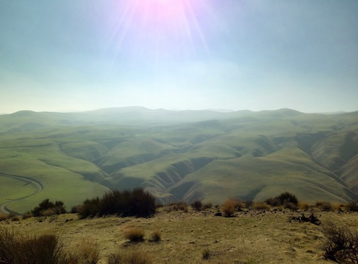
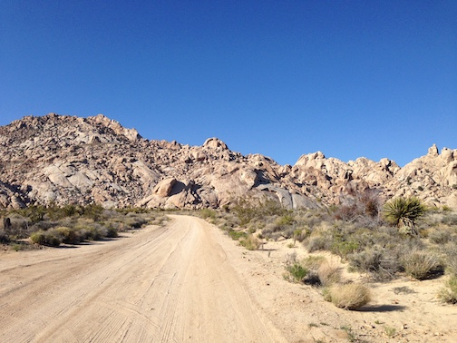

---
title:
author: "cjlortie"
date: "2018 redux"
output:
  html_document:
    theme: yeti
    toc: yes
    toc_depth: 3
    toc_float: yes
  pdf_document:
    toc: yes
---
##Patronus charm: a contrast of benefactor plant specificity

<br>
**Panoche Hills Ecological Reserve**  
  

**Mojave National Preserve**  
  


[ecoblender](http://ecoblender.org)  
<br>

**Precis**    
Deserts globally are subject to significant anthropogenic pressure. Global change, agriculture, energy projects, urbanization, and other ongoing drivers introduce stressors on the resilience of arid and semi-arid ecosystems. The capacity to buffer against these changes in the environment and biodiversity are important considerations for ecosystem functioning and applied decision-making frameworks. Foundation species analyses can be a solution to rapidly assess ecological function for a specific region. A foundation species is defined as species that exerts and promotes a positive set of processes for the network of resident species. Shrubs and cacti in California are both candidate representative functional grouping of plant species that benefit other plants and often animals within a region. Herein, we sampled the effect of shrubs and cacti on other plant species through systematic plant surveys on environmental gradients. The hypothesis tested was that the direct effects of dominant plants lead to facilitation of other plant species and thereby function as buffers to undue change. Colloquially, this can be termed a patronus charm effect within facilitation ecology because regardless of the form of the protector, the species provides a talisman against local loss of function. Gradients are also an important tool that can provide a critical estimate of the relative importance of ecological context within a region.

###Data
Panoche sites = 1.1 is plateau, 1.2 is south, 1.3 is north. The plateau is approx 5 km^2 and sites 1.2 and 1.3 are 1 acre. Extensive manipulative research including shrub removals and mimics done at Panoche site 1.1, the plateau.  

Mojave sites = a total of five sites with each on Kelbaker Road corresponding to increasing elevations of 313, 515, 737,951, & 1128m. 

**The simplified hypothesis tested is that foundation shrub effects are species specific.**  The importance of local gradients are also examined and cursorily framed within larger climate data.

*Ephedra californica* effects are contrasted to those of *Larrea tridentata* in two different desert sites at the upper and lower extents of the San Joaquin Desert Region.  
The cacti species *Cylindropuntia acanthocarpa* is also explored in brief for a presentation at CNPS.

```{r, data setup, warning=FALSE, message=FALSE}
library(tidyverse)
#meta-data in brief for field sampling
metadata <- read_csv("data/meta-data.csv")
knitr::kable(metadata)

#effect-size estimates
foundation.rii <- read_csv("data/shrub.rii.contrast.csv")
foundation.rii
foundation.rii <- foundation.rii %>% mutate(Volume = ((D1 + D2)/2)^3*3.14*(1/3))
foundation.rii$Year <- as.character(foundation.rii$Year)
foundation.rii$Site <- as.character(foundation.rii$Site)

#sites for shrub-shrub contrast
sites <- read_csv("data/sites.csv")
sites$Site <- as.character(sites$Site)
sites


#basic climate
climate <- read_csv("data/shrub.contrast.climate.csv")
climate$Site <- as.character(climate$Site)

```

###Map
```{r, map, warning=FALSE, message=FALSE}
require(ggmap)
cali <- get_map(location = c(lon = -118, lat = 35), zoom = 7)
#cali <-get_googlemap("california", crop= FALSE, zoom = 10)
p <-ggmap(cali)
p + geom_point(data=sites, aes(x=Long, y=Lat), alpha = 0.75, size = 1.5) + labs(x ="longitude", y = "latitude")

```

